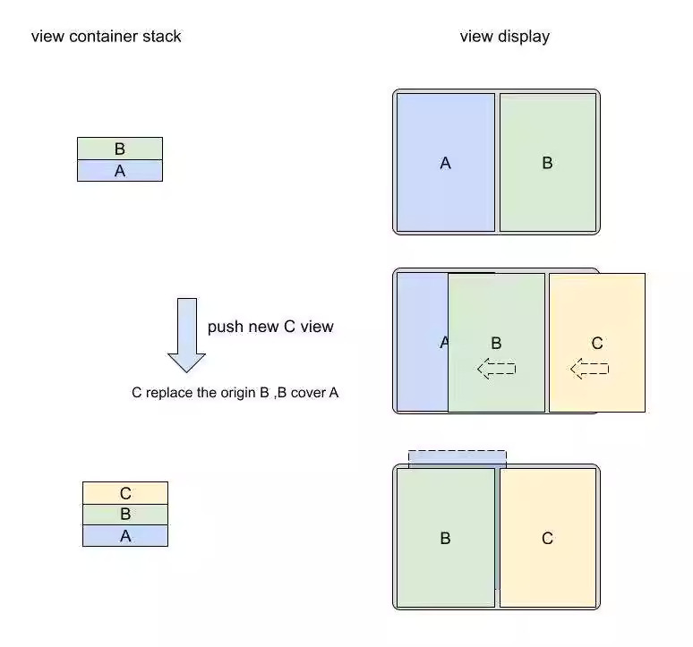

# ParallelViewController

[English README.md](README.md)

[](https://travis-ci.org/xiaoxiang/ParallelViewController)
[](https://cocoapods.org/pods/ParallelViewController)
[](https://cocoapods.org/pods/ParallelViewController)
[](https://cocoapods.org/pods/ParallelViewController)

实现类似Android折叠屏设备左右分屏模式


## Installation

ParallelViewController is available through [CocoaPods](https://cocoapods.org). To install
it, simply add the following line to your Podfile:

```ruby
pod 'ParallelViewController'
```


## Example

类似UINavigationController初始化需要传入一个RootViewController类似，我们需要传入左右两个ViewController。


导航模式

```objetive-c

DemoViewController * left = [[DemoViewController alloc]initWithNibName:@"DemoViewController" bundle:[NSBundle mainBundle]];

DemoViewController * right = [[DemoViewController alloc]initWithNibName:@"DemoViewController" bundle:[NSBundle mainBundle]];

ParallelNavigationModeViewController * containerController = [[ParallelNavigationModeViewController alloc]initWithLeftViewController:left rightViewController:right];

```


购物模式

```Objective-c
DemoViewController * left = [[DemoViewController alloc]initWithNibName:@"DemoViewController" bundle:[NSBundle mainBundle]];

DemoViewController * right = [[DemoViewController alloc]initWithNibName:@"DemoViewController" bundle:[NSBundle mainBundle]];

ParallelShoppingModeViewController * containerController = [[ParallelShoppingModeViewController alloc]initWithLeftViewController:left rightViewController:right];

```


**Push**


```
DemoViewController * newVC = [[DemoViewController alloc]initWithNibName:@"DemoViewController" bundle:[NSBundle mainBundle]];

[containerController pushViewController:newVC animated:YES];
```

**Pop**

```
[containerController popViewControllerAnimated:YES];
```


## 双屏比价模式
最新视图在最右屏，次新视图在最左屏。这种场景适合浏览多个商品宝贝进行比对。

以push四个ABCD界面为例子


竖屏时，和普通的UINavigationController一样。界面都是平铺到界面


横屏时，最新视图在最右屏，次新视图在最左屏。

Push界面



Pop界面


## 分屏导航模式

竖屏时，和普通的UINavigationController一样。

竖屏时，和普通的UINavigationController一样。界面都是平铺到界面


横屏时，左屏固定不变，最新、次新视图堆叠在右屏。这种场景适合左边是列表页，在右屏打开多个商品宝贝。其目的是让最新的界面在都在右边打开


Push界面


Pop界面


## Author

xiaoxiang, xiaoxiaowesley@gmail.com

## License

ParallelViewController is available under the MIT license. See the LICENSE file for more info.